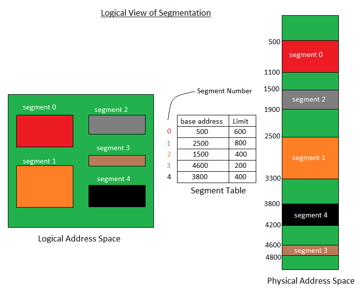
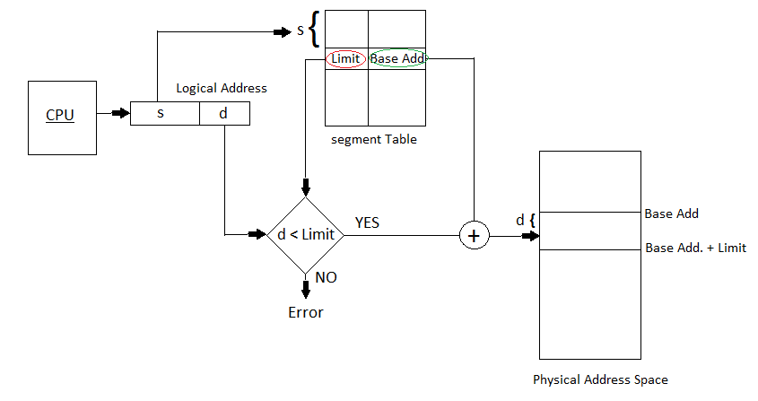

一个进程被化分为多个内存段。 程序所划分的内存段不一定全部相同大小。内存段使得用户可以查看分页不提供的流程。 在这里，用户视图被映射到物理内存。 

细分类型

1. 虚拟内存段 – 每个进程都分为多个内存段，同一时刻并非所有内存段都驻留内存。
2. 简单内存段 - 每个进程都分为多个内存段，运行时，所有内存段都在内存中，虽然不是紧密连续的。

在内存段中逻辑地址和物理地址之间没有任何的关系。 一个表存储段内存有关的信息，称为段表。

## 段表：
将二维逻辑地址映射为一维物理地址。

每个表条目都有：

* Base Address 基地址：它包含段驻留在内存中的起始物理地址。
* Limit 限制：它指定段的长度。

将二维逻辑地址转换为一维物理地址。

CPU生成的地址分为：
* Segment number (s) 段号：表示段所需的位数。
* Segment offset (d) 段偏移量（d）：表示段大小所需的位数。

分段的有点 –
* 没有内部碎片。
* 与分页中的“页”表相比，“段表”消耗的空间更少。

分段的缺点
* 在从内存中加载和删除进程时，可用内存空间会分成几小块，从而导致外部碎片。