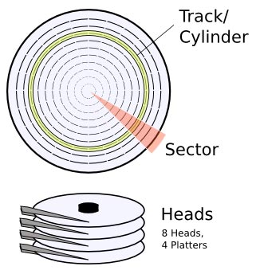

*基础知识储备: assembler, BIOS*
* Assembler 汇编语言是面向机器的程序设计语言
* BIOS是英文"Basic Input Output System"的缩略词，直译过来后中文名称就是"基本输入输出系统"。
**Goal: 创建一个BIOS可识别的文件，作为启动盘**

我们就好制作一个属于自己的启动扇区了，想想就让人兴奋

理论基础
------

当电脑开机的时候，BIOS不知道怎么加载系统，所以它把这任务交给磁盘的启动扇区。启动扇区需要设定在一个标准，通用的位置。这个位置是磁盘的第一扇区[(cylinder 0, head 0, sector 0),0柱，0磁头，0扇区]，其大小为512 bytes.

> 磁盘
> 
> △磁头(Heads)：每张磁片的正反两面各有一个磁头，一个磁头对应一张磁片的一个面。因此，用第几磁头就可以表示数据在哪个磁面。
>
> △柱面(Cylinder)：所有磁片中半径相同的同心磁道构成“柱面"，意思是这一系列的磁道垂直叠在一起，就形成一个柱面的形状。简单地理解，柱面数=磁道数。
>
> △扇区(Sector)：将磁道划分为若干个小的区段，就是扇区。虽然很小，但实际是一个扇子的形状，故称为扇区。每个扇区的容量为512字节。



> bytes 
>
> 欠 大B，小b知识

为了确保这是一个启动盘，BIOS检查启动扇区的511 512位的bytes是否为 `0xAA55`.

这是一个极简的启动扇区:

```
e9 fd ff 00 00 00 00 00 00 00 00 00 00 00 00 00
00 00 00 00 00 00 00 00 00 00 00 00 00 00 00 00
[ 29 more lines with sixteen zero-bytes each ]
00 00 00 00 00 00 00 00 00 00 00 00 00 00 55 aa
```

它基本都是0，末尾是16小b的数据，16-bit 值为`0xAA55` (注意末尾, x86 是小端格式 *little-endian*). 
最开始的 3 Bytes是执行无限循环

简单到不能再简单的启动扇区
-------------------------
> hexdump for VSCode
>
> 这个插件可以直接编写查看2进制

你可以用二进制编辑器编辑这512Bytes，或者可以使用最简单的汇编代码；
You can either write the above 512 bytes
with a binary editor, or just write a very
simple assembler code:

```nasm
; Infinite loop (e9 fd ff)
loop:
    jmp loop 

; 减去无限循环的3B，以及结尾的aa55，剩下510位填0
times 510-($-$$) db 0
; Magic number
dw 0xaa55 
```

编译:
`nasm -f bin boot_sect_simple.asm -o boot_sect_simple.bin`

> 可以查看一下用2进制编辑器查看一下 `boot_sect_simple.bin` 文件
> 
> 在为的mac上翻译出来是 `EB FE` 不是文中提及的 `e9 fd ff` 。 我查了一下。
> 
> 16位模式下 
> 
> * `0xfffd = -3` 
> * JMP指令：`E9 cw / JMP rel16 / 相对近跳转，位移量相对于下一条指令`
> 
> 所以就是跳转到之前3位，正好又是跳转指令
```text
In 16bit mode, e9 fd ff is an instance of jmp rel16. The offset 0xfffd is -3, since jump offsets are "from the start of the next instruction", that's 3 bytes back from that first 00, so back to the jmp.
```
> 所以根据指令。 `EB cb / JMP rel8 /相对短跳转，位移量相对于下一条指令`。
> 
> `EB FE`的意思为，跳转到前1位

> Mac系统警告: 如果本章编译不顺利，可能是nasm有问题，看00章

I know you're anxious to try it out (I am!), so let's do it:

`qemu boot_sect_simple.bin`

> 某些系统上, 也许需要运行 `qemu-system-x86_64 boot_sect_simple.bin` 如果发现 SDL 的相关错误, 尝试添加参数 --nographic 或 --curses flag(s) 或都加

然后就是空窗口，保持无限循环了。OK！
> --nographic 不会弹出图形界面，`Booting from Hard Disk...` 是在终端中打印的
> qemu-system-x86_64 boot_sect_hello.bin --nographic 