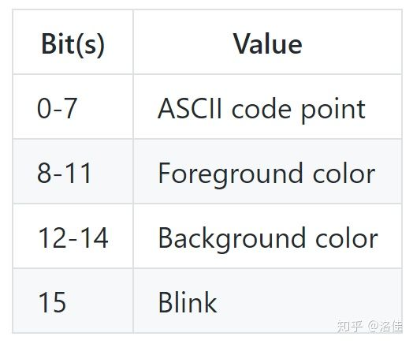

VGA字符缓冲区
为了在VGA字符模式向屏幕打印字符，我们必须将它写入硬件提供的VGA字符缓冲区（VGA text buffer）。通常状况下，VGA字符缓冲区是一个25行、80列的二维数组，它的内容将被实时渲染到屏幕。这个数组的元素被称作字符单元（character cell），它使用下面的格式描述一个屏幕上的字符：

其中，前景色（foreground color）和背景色（background color）取值范围如下：

每个颜色的第四位称为加亮位（bright bit）。

要修改VGA字符缓冲区，我们可以通过存储器映射输入输出（memory-mapped I/O）的方式，读取或写入地址0xb8000；这意味着，我们可以像操作普通的内存区域一样操作这个地址。

需要主页的是，一些硬件虽然映射到存储器，却可能不会完全支持所有的内存操作：可能会有一些设备支持按u8字节读取，却在读取u64时返回无效的数据。幸运的是，字符缓冲区都支持标准的读写操作[1]，所以我们不需要用特殊的标准对待它。